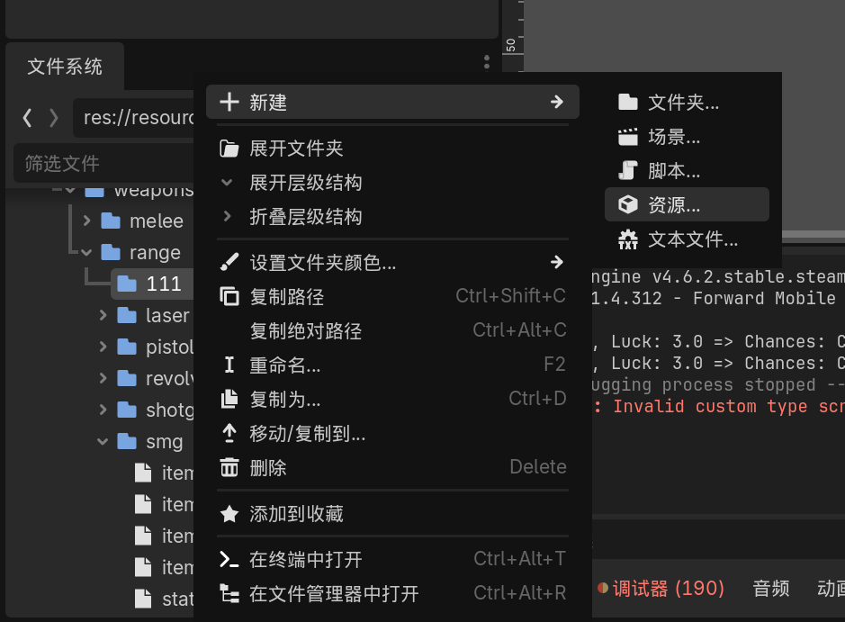
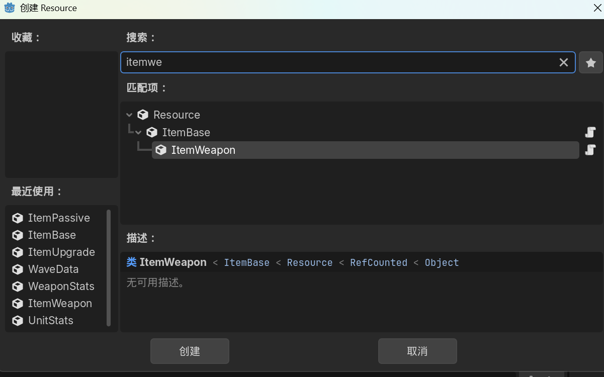
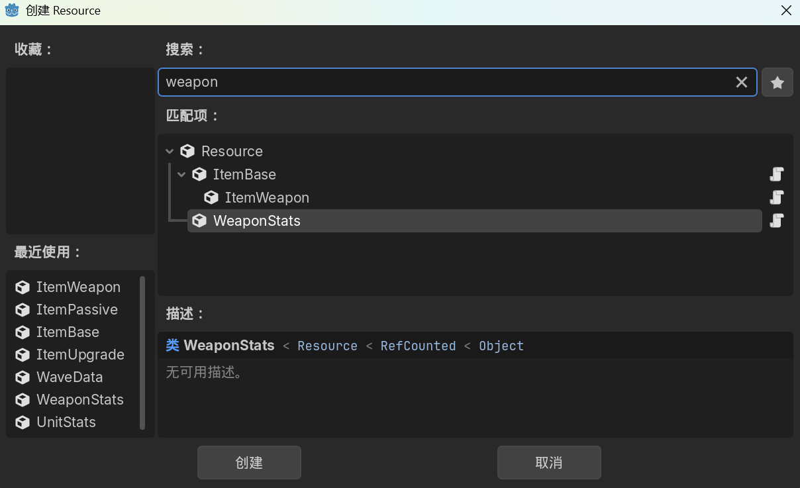
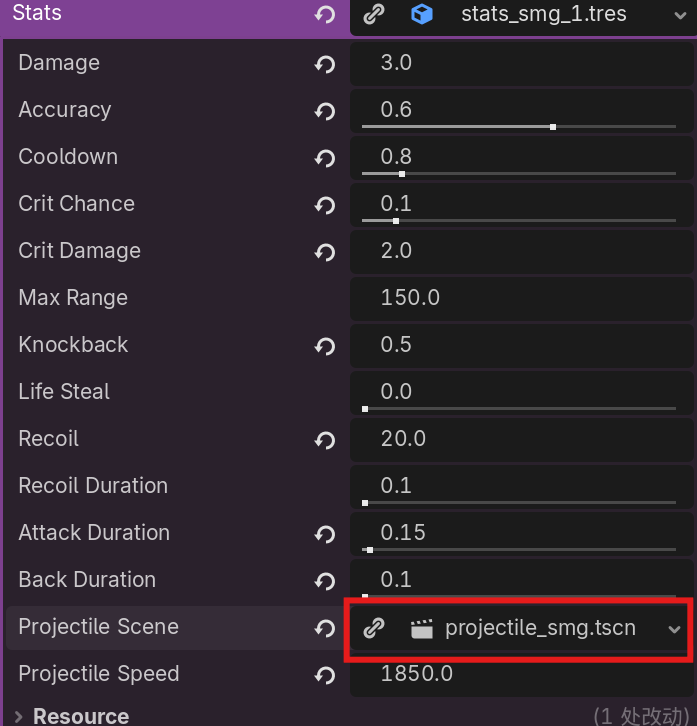

## 文件路径
- **武器资源文件夹** 
    res://resources/items/weapons/
- **初始武器选择页** 
    res://scenes/ui/selection_panel/selection_panel.tscn
- **射弹的文件夹**
    res://scenes/projectiles/
- **武器场景文件夹** 
    res://scenes/weapons/
- **武器贴图文件夹**
    res://assets/sprites/Weapons/
## 创建方法
### 远程武器
#### 创建武器场景
1. 找到**手枪场景**作为模板场景 res://scenes/weapons/range/weapon_pistol.tscn
2. 在“文件系统”中右键**手枪场景**，选择“新建继承场景”
3. 配置武器场景
   - 武器贴图：Sprite2d节点的“Texture”属性
   - 射弹生成点：Sprite2d节点的子节点Muzzle的位置即为射弹生成点
4. 命名，保存
#### 创建射弹
1. 找到**手枪射弹场景** res://scenes/projectiles/projectile_pistol.tscn
2. 在“文件系统”中右键**手枪射弹场景**，选择“新建继承场景”
3. 配置射弹场景
   - 射弹贴图：Sprite2d节点的“Texture”属性
   - 碰撞箱大小：推荐修改HitboxComponent2下CollisionShape2D 的TransForm信息
4. 命名，保存
#### 创建武器资源与武器属性
1. 在 res://resources/items/weapons/range/ 下新建文件夹，命名文件夹
2. 右键文件夹-新建-资源……
3. 选择ItemWeapon
4. 命名 item_{武器名}_{武器等级，从1开始}
5. 在同文件夹下创建**武器属性资源** 命名 stats_{武器名}_{武器等级，从1开始}
   1. 
   2. 也可直接在itemweapon资源中直接新建，为配置方便再另存为到同文件夹下
6. 配置资源
   1. 射弹：

### 近程武器
与创建远程武器相似
**拳头场景**作为模板场景：res://scenes/weapons/melee/weapon_punch.tscn