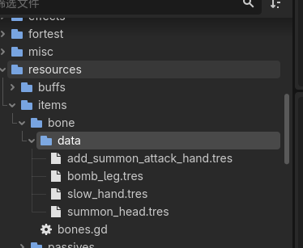
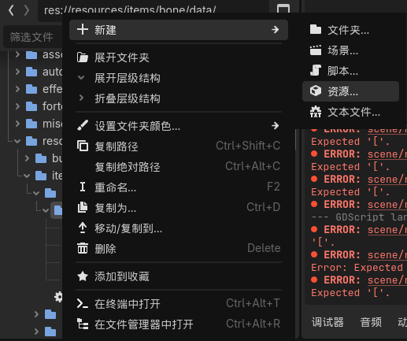
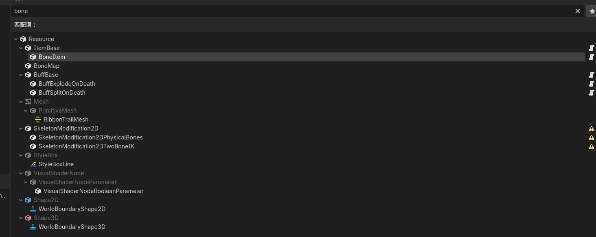
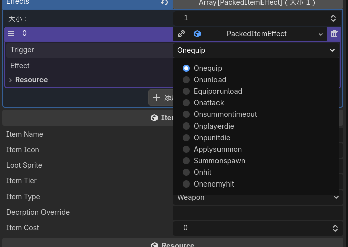

道具资源文件夹
res://resources/items/bone/data/

## 新建道具资源
1. 右键“data”文件夹
2. 新建->资源->boneitem

## 配置资源

描述使用bbcode，以造出彩色文本等

现在只用这5个触发时机：
Equiporunload
Onattack
Onsummontimeout
Summonspawn
Onenemyhit

## 装到游戏里面
1. 初始道具选项：
   1. Arena 场景内 SelectionPanle 的Start Item属性上添加
2. Shop道具池：
   1. Arena 场景内 ShopPanel节点 ShopItem属性上添加